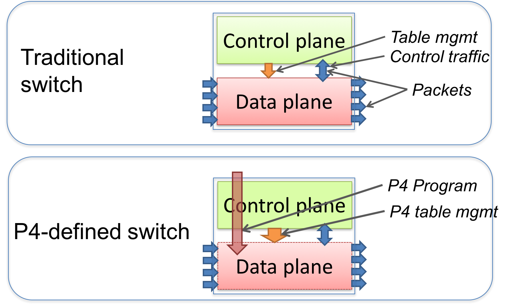
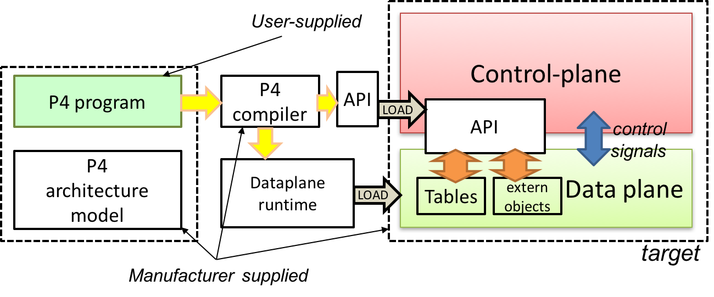

I have been looking at various technologies surrounding SDN and programmability for some months now, and of the bunch that I encountered, the term "P4" is one that pops around quite often. I will attempt to document my exploration of the P4 language in this post.

## P4 specification

The `Programming Protocol-independent Packet Processors (P4)` is a DSL (domain specific language) that allows operators to program network devices to specify how packets must be processed.
Going through the [P4-16 specification](https://p4.org/p4-spec/docs/P4-16-v1.0.0-spec.html#sec-p4-keywords) is a great place to start on understanding P4's architecture and organization. P4 changes the manner in which the network fabric works as such:



Dataplanes in conventional networking gear were fixed by manufacturers by what was hard coded into the hardware. Operators configured networking protocols and rules by managing the control plane. The control plane installs entries in tables (route tables), specialized objects exposed by the manufacturer defined data plane, and processing control packets (such as routing control traffic) or async events (link state updates/learning notifications). Nowadays manufacturers also sell products that also automate away a lot of the "control" that operators manage.

With P4, operators can now load dataplane behavior by loading a P4 program, which is compiled into
- a control program that installs rules and hardware level constructs (`extern`s) into the dataplane targets
- a dataplane runtime that loads into the target and dictates how packets are processed



## P4 program architecture

The world of P4 programmed dataplanes revolves around the concept of **reconfigurable match-action tables** (RMT). These "match-actions" can be described as transformations that map vectors of bits to vectors of bits. These transformations allow for processing to be carried out on packet header values.

The idea is that packets must be processed at line rate (the speed of data transmission over the network) which today is Gigabit speed at the least. This means that we cannot reasonably allow for the control flow in packet processing programs to take an indefinite number of steps towards processing a network packet. Instead, the processing program limits itself to a fixed number of steps for each byte of a network packet being processed. As said in the spec doc:

> the computational complexity of a P4 program is linear in the total size of all headers, and never depends on the size of the state accumulated while processing data (e.g., the number of flows, or the total number of packets processed).

This is important to understand as a P4 programmer. The way that P4 works on packets is that it performs a fixed set of "blocks" that perform transformations in a pipeline fashion, with a block being programmed by a fragment of the P4 code a programmer writes. The blocks interact with the hardware targets' using control registers or signals (*intrinsic metadata* which describes info specific to the hardware target architecture), for instance to understand an input port that a packet was received on, and the P4 program influences the target behavior, for instance selecting the output port to send a packet. P4 programs can store and manipulate data for a packet in *user defined metadata*.

For a "simple switch architecture" these blocks are pipelined into a step of programmable sections:

1. Parse the header fields
2. Verify the packet's checksum
3. Ingress blocks, processing of header fields
4. Egress blocks, processing of header fields to decide egress actions
5. Re-compute checksum
6. "Deparse" the header fields

These blocks are defined at the end of a P4 program:

```p4
V1Switch(
  MyParser(),
  MyVerifyChecksum(),
  MyIngress(),
  MyEgress(),
  MyComputeChecksum(),
  MyDeparser()
) main;
```

where the functions inside the `V1Switch` are user implemented, but provided by the architecture.

### Dataplane interfaces

To program these blocks, the P4 architecture gives the programmer access to `parser` and `control` interfaces -- and this can be programmed using a data-dependent (basically input dependent) sequence of **match-action** *unit* invocations and other *imperative* constructs.

Example taken directly from [P4-16 reference](https://p4.org/p4-spec/docs/P4-16-v1.0.0-spec.html#sec-dp-interfaces):

```p4
control MatchActionPipe<H>(in bit<4> inputPort,
                           inout H parsedHeaders,
                           out bit<4> outputPort);
```

- The first parameter is a 4-bit value named `inputPort`. The direction `in` indicates that this parameter is an input that cannot be modified
- The second parameter is an object of type H named `parsedHeaders`, where H is a type variable representing the headers that will be defined later by the P4 programmer. The direction `inout` indicates that this parameter is both an input and an output
- The third parameter is a 4-bit value named `outputPort`. The direction `out` indicates that this parameter is an output whose value is undefined initially but can be modified

### extern objects

The target architecture may provide some objects and functions -- for instance, `verifyChecksum` or `log_msg` functions. Extern objects are like abstract classes in object oriented programming languages. They define which methods are implemented by an object but not how they are implemented- that is up to the programmer.

```p4
extern Checksum16 {
    Checksum16();              // constructor
    void clear();              // prepare unit for computation
    void update<T>(in T data); // add data to checksum
    void remove<T>(in T data); // remove data from existing checksum
    bit<16> get(); // get the checksum for the data added since last clear
}
```

## Example

A descriptive example of a very simple switch program (VSS) can be found [here](https://p4.org/p4-spec/docs/P4-16-v1.0.0-spec.html#sec-vss-example).

## Handy resource for experimenting with P4

I am trying to learn programming with P4 using the [P4 tutorials GitHub repository](https://github.com/p4lang/tutorials). It is quite a helpful resource that allows users to spin up P4 programmed network setups (such as one with basic packet forwarding) in Mininet.

